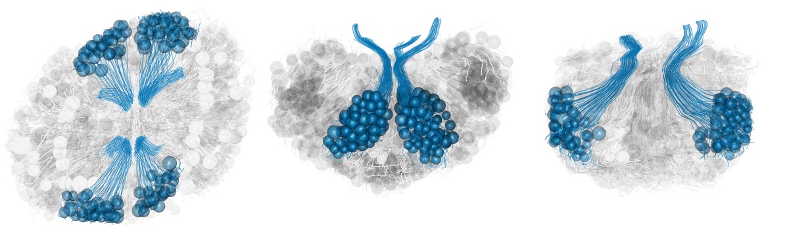

#  Gravity sensors function as a pacemaker for comb plate beatings 

× 0.15 speed
50 µm
balancer cilia
statolith
5 cm
apical organ
Tamm S.L., 1982

---
class: inverse
background-image: url('assets/img/image6.png')
background-size: cover

---
class: inverse
background-image: url('assets/img/image5.png')
background-size: cover

---
class: inverse
background-image: url('assets/img/image4.png')
background-size: cover

---
class: inverse
background-image: url('assets/img/image3.png')
background-size: cover

---
#  The tendency to turn up or down, “signs of geotaxis” can be switched. 

Positive geotaxis
Negative geotaxis
Turn anti-clock wise!
Turn clock wise!
gravity
gravity
Tamm S.L., 1980

---

